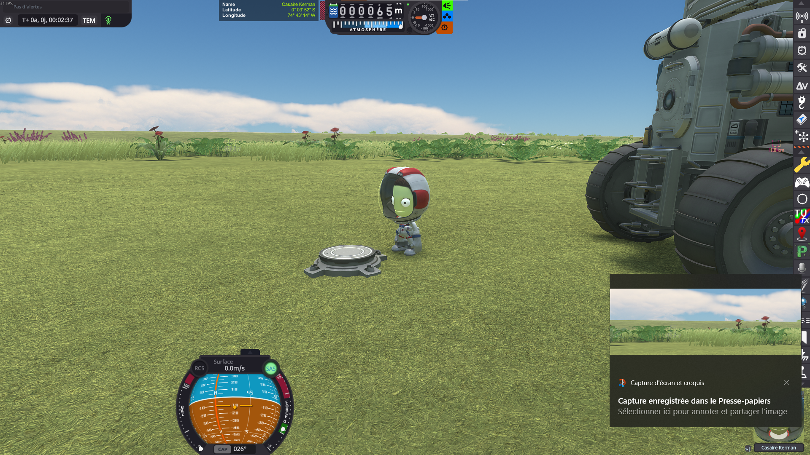
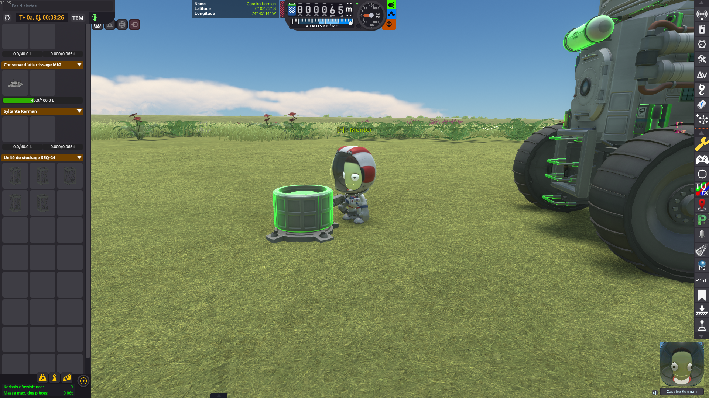
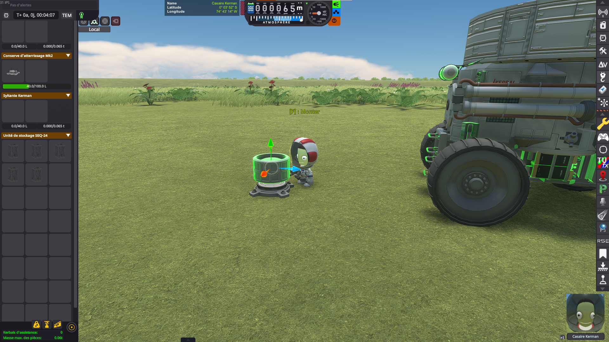
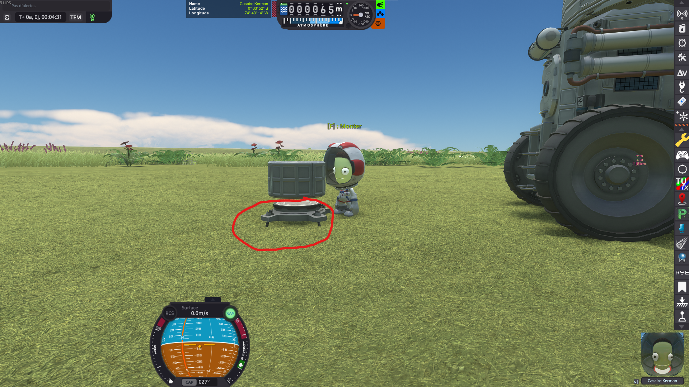
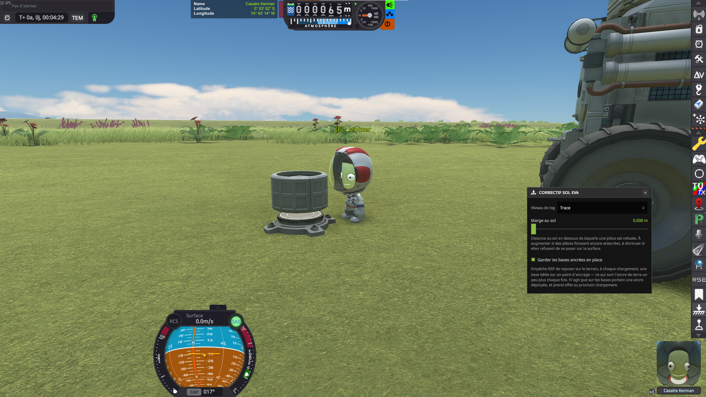

# EVA Construction Mode Ground Fix

A Kerbal Space Program mod that fixes two independent bugs affecting bases built in EVA Construction
Mode:

1. **Parts can be placed underground.** Nothing in the game refuses it, and the damage only shows up
   on the next reload, when KSP tries to put the vessel back above the surface.
2. **A base built on a ground anchor rises out of the ground at every reload.** KSP puts it back down
   on the terrain each time it loads, which pulls the anchor's spikes out and welds them a little
   higher. This one has nothing to do with where the player put the parts.

Both are active as soon as the mod is installed, and each can be turned off on its own.

---

# Fix 1 — Parts placed underground

## The problem

KSP's EVA Construction Mode lets a kerbal move a part anywhere — including *below* the surface.
Nothing in the game refuses that placement, and nothing warns about it. The damage only shows up on
the next reload, when the game tries to put the vessel back above the ground.

Here is the whole sequence, on Minmus.

### 1. An engineer deploys a ground anchor

A Clamp-O-Tron is dropped on the surface, and becomes the root of the future structure.

### 2. Parts are attached to it in EVA Construction Mode

A first truss segment goes on the anchor…

…then a second one…

…then a third one.

### 3. A part is grabbed again, rotated and moved

The last segment is picked up and repositioned with the translation/rotation gizmo.

### 4. …and ends up in the ground

Nothing stops the segment from sinking into the surface: it is dropped there, half buried, and the
game accepts it as a perfectly valid placement.

### 5. Save, reload — and the structure is ruined

What happens next depends on whether [KSPCommunityFixes](https://github.com/KSPCommunityFixes/KSPCommunityFixes)
is installed, but neither outcome is the one you built.

**With KSPCommunityFixes.** The buried segment is no longer in the ground, but the whole structure
has been distorted to get it out: the trusses are twisted and splayed apart, and the assembly no
longer has the shape it was given.

**In stock.** The structure keeps its shape, but the game raises *everything* until no part is
underground — the ground anchor included. The Clamp-O-Tron, which was bolted to the surface, now
floats in mid-air, and the whole structure hangs several meters above Minmus.

## The fix

This mod attacks the problem at the source: rather than repairing the vessel on reload, it makes the
invalid placement impossible in the first place. Step 4 above simply cannot happen — the part refuses
to go below the surface, so the reloaded structure is exactly the one that was built.

While EVA Construction Mode is on, the mod watches every part being moved and **truncates** the
requested move: the part travels up to the real ground contact, minus the configured ground offset.

## Technical details

- Every collider of the moved part is tested against the scenery with Unity's physics system
  (`OverlapBox` / `OverlapCapsule` / `OverlapSphere`, then `ComputePenetration` to discard the
  overlaps that are not real penetrations).
- Box, capsule, sphere and mesh colliders are all supported.
- The test volume is dropped by the configured *ground offset*, so a part is refused slightly before
  it actually reaches the surface.
- The move is truncated rather than refused, so a part always ends up in contact with the ground
  instead of anywhere above it.

---

# Fix 2 — Anchored bases that rise at every reload

## The problem

This one is not about where the player puts the parts. Merely *touching* a part is enough — even
moving it **upwards**, away from the ground.

### 1. An engineer deploys a ground anchor

### 2. A part is attached to it in EVA Construction Mode

### 3. The part is moved up, well clear of the ground

The offset gizmo pulls the tank *away* from the surface, so nothing here can possibly be a case of a
part being pushed underground.

### 4. Save, reload — and the anchor has taken off

The anchor's spikes are out of the ground and the whole assembly floats above the grass. Do it again
and it climbs a little higher.

## The fix

With the mod installed, the very same save reloads with the anchor firmly seated where it was built.

What is really happening is that the saved position was right all along: KSP was lifting the vessel
at load time, and the fix simply stops it from doing so.

## Technical details

`Vessel.GoOffRails` only spares a landed vessel whose stored PQS subdivision levels match the live
terrain controller. A part dropped in EVA Construction Mode is created with those levels set to zero
(`EVAConstructionModeEditor.GetProtoVesselNode` writes them in), so the vessel it becomes never
passes that test and `CheckGroundCollision` re-grounds it at every load — placing it so that its
lowest collider point rests exactly on the terrain, which for an anchor means spikes in the air. The
10 cm dead zone that would normally absorb such a small correction is *explicitly disabled* for a
vessel whose root part is a ground part, so an anchored base swallows corrections nothing else would.
`KSP.log` shows the pass as `ground contact! - error. Moving Vessel up 0.001m`.

The fix hooks `GameEvents.onProtoVesselLoad` and writes the levels the vessel should have had, which
puts KSP back on its normal "nothing to do here" path. It only ever touches a landed vessel that
carries a deployed ground anchor **and** was saved with uninitialized levels; a base whose levels are
merely out of date (the terrain detail setting really did change) is left to KSP, and a freshly
dropped anchor still gets its initial seating.

It is also curative rather than palliative: the levels it writes are persisted by the next save, so
a base only needs to be loaded once with the fix on to be repaired for good.

---

## Settings

The mod adds a button to the application launcher (in flight and at the space center) that opens a
small settings window:

- **Log level** - how much the mod writes to `KSP.log`.
- **Ground offset** - how close to the ground a part may come before the placement is refused
  (0.010 m by default). Raise it if parts still end up buried, lower it if they refuse to sit on the
  surface.
- **Keep anchored bases in place** - fix 2 above, on by default. Takes effect at the next load, since
  a vessel already in the scene has been positioned already.

They are settings of the *installation*, not of a save: they are stored in
`GameData/EvaCMGroundMod/PluginData/settings.cfg` and applied as soon as they are changed. Deleting
that file restores the defaults, which have both fixes on.

## Installation

1. Download the latest release
2. Extract the contents to your KSP GameData folder
3. Fix 1 activates when you enter EVA Construction Mode, fix 2 at the next vessel load

## Requirements

- Kerbal Space Program 1.12 or later
- Breaking Ground DLC (for EVA Construction Mode)

## License

This mod is released under the MIT License. See the LICENSE file for details.
