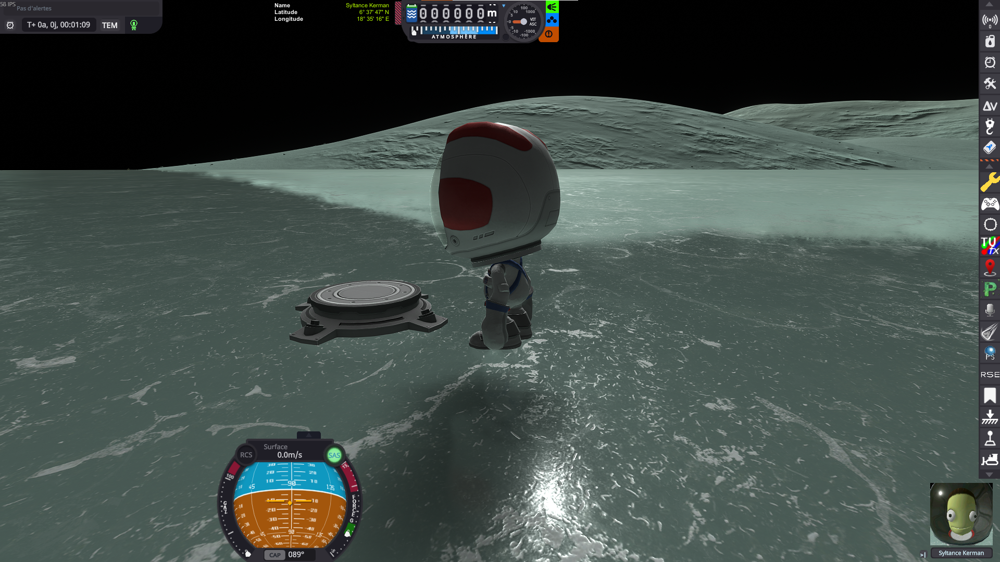
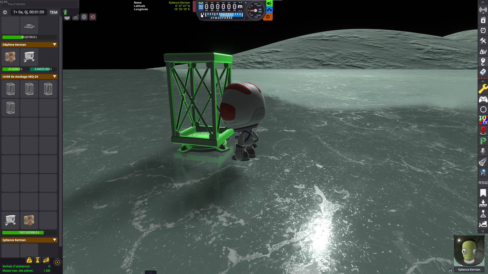
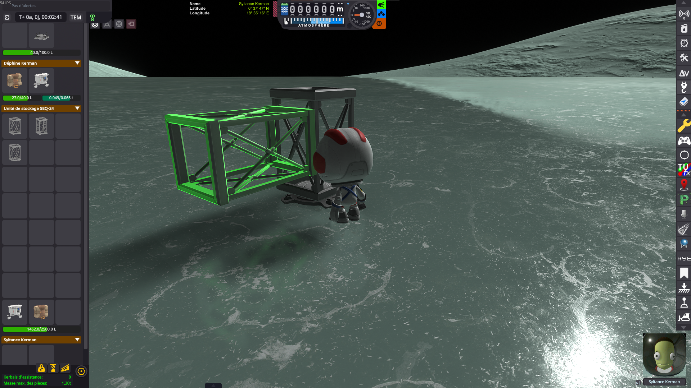
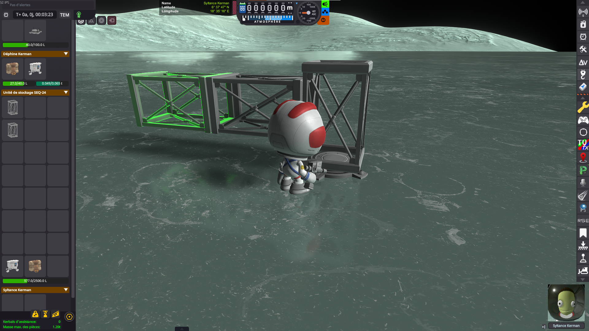
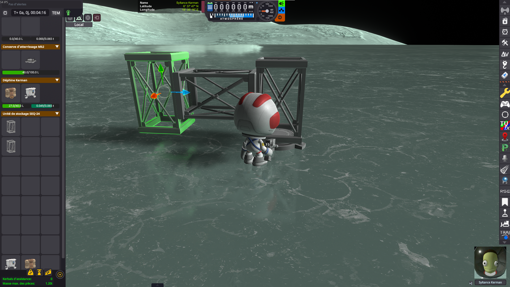
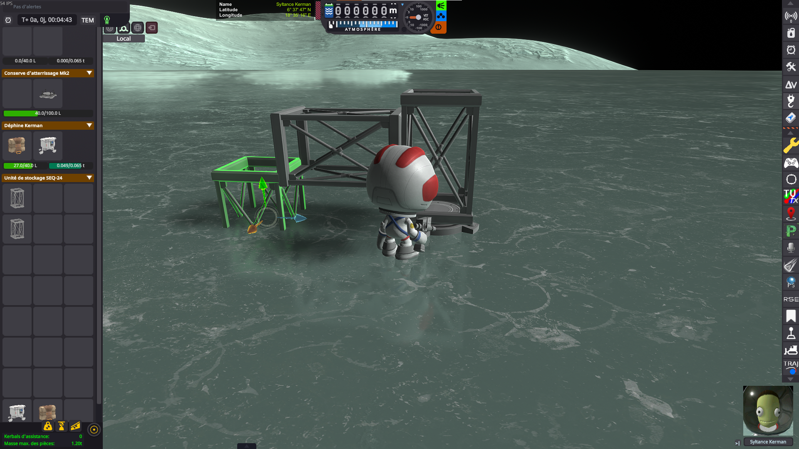
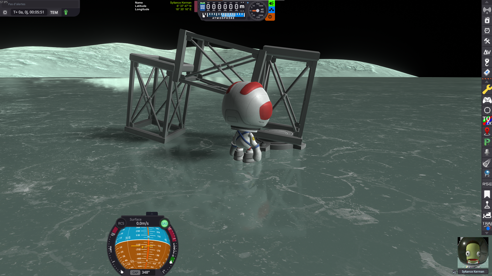
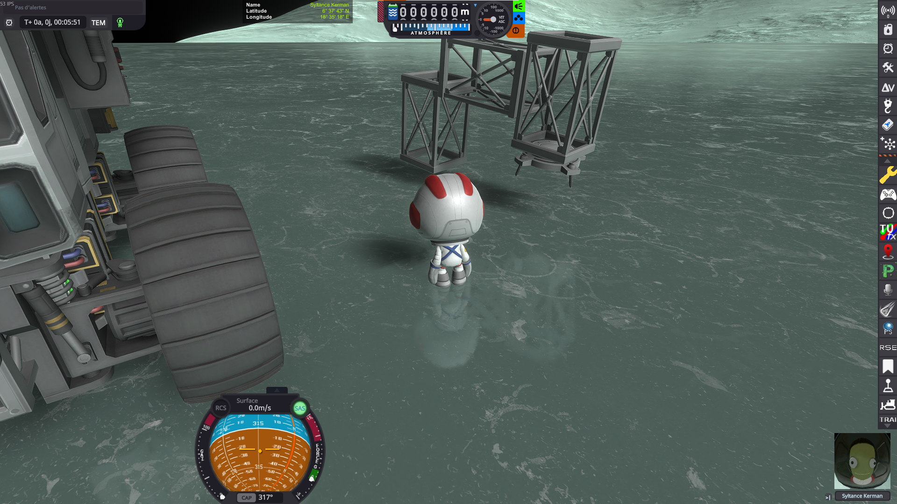

# EVA Construction Mode Ground Fix

A Kerbal Space Program mod that prevents parts from being placed underground during EVA Construction
Mode.

## The problem

KSP's EVA Construction Mode lets a kerbal move a part anywhere — including *below* the surface.
Nothing in the game refuses that placement, and nothing warns about it. The damage only shows up on
the next reload, when the game tries to put the vessel back above the ground.

Here is the whole sequence, on Minmus.

### 1. An engineer deploys a ground anchor

A Clamp-O-Tron is dropped on the surface, and becomes the root of the future structure.

### 2. Parts are attached to it in EVA Construction Mode

A first truss segment goes on the anchor…

…then a second one…

…then a third one.

### 3. A part is grabbed again, rotated and moved

The last segment is picked up and repositioned with the translation/rotation gizmo.

### 4. …and ends up in the ground

Nothing stops the segment from sinking into the surface: it is dropped there, half buried, and the
game accepts it as a perfectly valid placement.

### 5. Save, reload — and the structure is ruined

What happens next depends on whether [KSPCommunityFixes](https://github.com/KSPCommunityFixes/KSPCommunityFixes)
is installed, but neither outcome is the one you built.

**With KSPCommunityFixes.** The buried segment is no longer in the ground, but the whole structure
has been distorted to get it out: the trusses are twisted and splayed apart, and the assembly no
longer has the shape it was given.

**In stock.** The structure keeps its shape, but the game raises *everything* until no part is
underground — the ground anchor included. The Clamp-O-Tron, which was bolted to the surface, now
floats in mid-air, and the whole structure hangs several meters above Minmus.

## The fix

This mod attacks the problem at the source: rather than repairing the vessel on reload, it makes the
invalid placement impossible in the first place. Step 4 above simply cannot happen — the part refuses
to go below the surface, so the reloaded structure is exactly the one that was built.

While EVA Construction Mode is on, the mod watches every part being moved, and as soon as a part
would touch the ground it is put back where it last was.

## Technical details

- Every collider of the moved part is tested against the scenery with Unity's physics system
  (`OverlapBox` / `OverlapCapsule` / `OverlapSphere`, then `ComputePenetration` to discard the
  overlaps that are not real penetrations).
- Box, capsule, sphere and mesh colliders are all supported.
- The test volume is dropped by the configured *ground offset*, so a part is refused slightly before
  it actually reaches the surface.
- The last valid position and rotation of the part are kept, and restored whenever an invalid
  placement is detected.

## Second fix: anchored bases that rise at every load

Optional, and off by default. It addresses a different KSP bug, the one behind step 5 above in
stock: a landed base built on a ground anchor is put back down on the terrain **every time it
loads**, which pulls the anchor's spikes out of the ground, welds them at that new height, and so
raises the base a little more at each cycle.

`Vessel.GoOffRails` only spares a landed vessel whose stored PQS subdivision levels match the live
terrain controller. A part dropped in EVA Construction Mode is created with those levels set to
zero, so the vessel it becomes never passes that test, and `CheckGroundCollision` re-grounds it at
every load — with the 10 cm dead zone that would normally absorb the correction explicitly disabled
for a vessel whose root part is a ground part. `KSP.log` shows it as
`ground contact! - error. Moving Vessel up 0.001m`.

The fix writes the levels the vessel should have had, so KSP takes its normal "nothing to do here"
path. It only ever touches a landed vessel that carries a deployed ground anchor **and** was saved
with uninitialized levels; a base whose levels are merely out of date (the terrain detail setting
really did change) is left to KSP, and a freshly dropped anchor still gets its initial seating.

## Settings

The mod adds a button to the application launcher (in flight and at the space center) that opens a
small settings window:

- **Log level** - how much the mod writes to `KSP.log`.
- **Ground offset** - how close to the ground a part may come before the placement is refused
  (0.010 m by default). Raise it if parts still end up buried, lower it if they refuse to sit on the
  surface.
- **Keep anchored bases in place** - the second fix above (off by default). Takes effect at the next
  load, since a vessel already in the scene has been positioned already.

They are settings of the *installation*, not of a save: they are stored in
`GameData/EvaCMGroundMod/PluginData/settings.cfg` and applied as soon as they are changed. Deleting
that file restores the defaults, which leaves the second fix off.

## Installation

1. Download the latest release
2. Extract the contents to your KSP GameData folder
3. The mod will automatically activate when you enter EVA Construction Mode

## Requirements

- Kerbal Space Program 1.12 or later
- Breaking Ground DLC (for EVA Construction Mode)

## License

This mod is released under the MIT License. See the LICENSE file for details.
